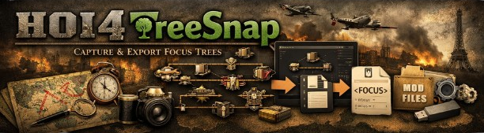
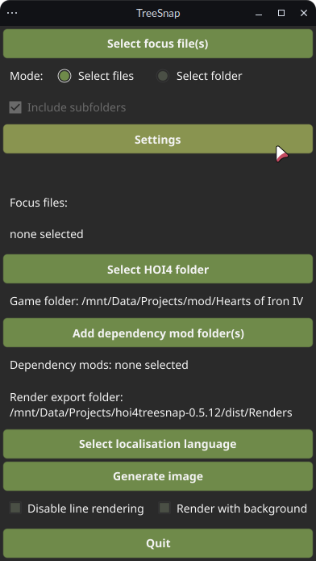
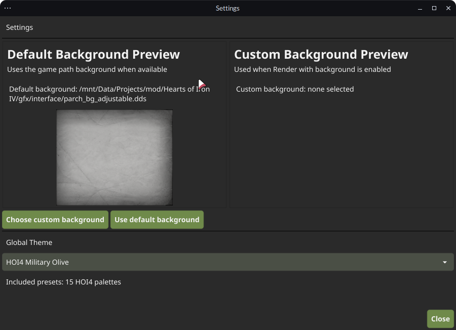
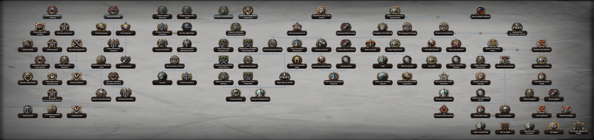
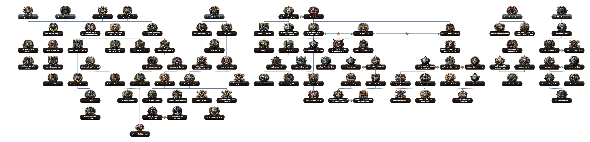

# hoi4treesnap




hoi4treesnap generates Hearts of Iron IV focus tree screenshots.

The tool itself does not contain any textures and picks them up from the HOI4 base game or a mod that contains selected focus trees. That includes all focus tree graphics: focus icons, focus tree plaques, focus tree lines and fonts. `nationalfocusview.gui` is being parsed to pick on your changes to it, so the output image looks quite similar to what you see in the game, even a modded one.

## Changelog

### Major features

- **Parallel multi-file rendering** — folder selections now render in a bounded worker pool (`runtime.NumCPU()` workers) via a hidden env-based worker subprocess mode in `parallel_generation.go`, keeping the UI responsive and maximising CPU utilisation while avoiding shared-global races.
- **In-run cancellation** — during rendering the Quit button is joined by a Cancel button; cancellation is propagated through shared-context prep, scan workers, render workers, and per-focus steps, returning cleanly with a "Generation cancelled" message rather than an error.
- **Settings window** — a dedicated Settings panel (accessible via button below the focus controls) lets users choose from a wide palette of HOI4-themed colour presets and pick or reset a custom background image. Theme and custom background path are persisted to `config/settings.json` under the output folder and restored on relaunch.
- **Background rendering** — an optional "Render with background" toggle tiles `parch_bg_adjustable.dds` (or a user-supplied image/`.webm` first frame extracted via ffmpeg) behind the focus tree canvas. Falls back through a chain of DDS tile candidates and finally a solid opaque colour so output is never left transparent.
- **Structured application logging** — all diagnostic output is written via `log/slog` to a rotating log under `logs/hoi4treesnap.log` next to the output folder. Per-run error diagnostics go to a timestamped file under `logs/DD-MM-YYYY/HH-MM-SS-...-error.log`; the stale single-file approach has been removed.
- **Loading animation** — an embedded `hoi4 loading.gif` is shown in the progress area during active generation and hidden at idle, giving clear visual feedback that the tool has not frozen.
- **Native file/folder dialogs** — file and directory pickers now use `github.com/sqweek/dialog` (resizable native dialogs) instead of Fyne's built-in choosers, for game folder, mod folder, and focus file selection.
- **Focus picker rework** — the focus file picker supports a file/folder mode toggle, optional recursive folder scan, focus-tree content filtering, inline empty-folder feedback, and per-entry removal that recomputes `focusTreePaths` live.

### Parser improvements

- Grammar expanded to cover modern and base-game PDX syntax: `|`, `[ ... ]`, `?`, and broader comparison operators (`>=`, `<=`, `!=`, `==`); symbolic lvalues like `2.ITA_*` now parse correctly.
- Input is normalised centrally before every parse: UTF-8 BOM stripped, numeric percentage suffixes (`35%` → `35`) rewritten, and unmatched top-level closing braces salvaged with a retry pass (`stripUnmatchedClosingBraces`).
- Malformed focus files are skipped instead of aborting the whole run; parsing errors are logged and a summary dialog lists skipped files at the end. Generation only hard-errors if no files parse successfully.

### Rendering improvements

- Missing focus icon textures no longer abort rendering; `renderFocus` logs a warning and falls back to the `GFX_goal_unknown` icon.
- Sprite texture fallback resolution normalises leading separators before probing mod and game paths, improving cross-mod robustness.
- `getFrame` hardened for `NoOfFrames <= 0`, out-of-bounds frame indices, and invalid frame dimensions to prevent divide-by-zero / nil-frame panics.
- `renderLines` now checks each `readTextureAndGetFrames` call individually; previously only the last error was inspected, which could leave nil images and cause nil-pointer panics.
- Nil images from `FocusLine.Get()` are guarded at the render callsite.

### Localisation improvements

- Large `.yml` localisation files are now parsed with a fast line-scanner (`parseLocFile`) instead of the PEG parser, fixing severe slowdown and missing text on large mod localisation sets.
- Fallback focus labels (used when localisation is absent or the value is itself an unresolved key) are humanised: leading 2–4 character country-tag prefixes (`AUS_`, `mac_`, etc.) are stripped and the remainder is title-cased (e.g. `MAC_reform_army` → `Reform Army`).

### UI / UX

- Progress display shows current task name and overall percentage (e.g. `Parsing GFX: ... (18.0%)`), with file/folder-aware task text during scan, shared-context, and render phases.
- Shared-context prep (the 0–25 % phase) parallelises focus requirement discovery via a `scan-focus` worker mode, reducing the pre-render bottleneck on multi-core machines.
- Worker stderr is sanitised before surfacing errors (GTK theme warning noise filtered) and malformed worker messages are replaced with canonical `Skipping malformed focus file …` lines.
- End-of-run malformed-file dialog shows a short summary only; full details are in `logs/error.log`.
- Action row layout uses `container.NewBorder` to anchor Quit / Cancel buttons at the bottom edge; idle state removes progress widgets from layout and syncs window to content min-size, eliminating residual blank space after cancel or run completion.
- Theme selection offers a broad palette covering charcoal, warm utility, parchment (light/aged/event), brassworks, research/naval blues, military olive, and alert/command reds — applied app-wide at runtime.
- Output PNGs are exported to a `Renders` subfolder adjacent to the binary (or adjacent to `$APPIMAGE` when running as an AppImage); the UI shows the resolved export path.

### Bug fixes

- Background tile loading now prefers `tiled_bg.dds`, skips fully-transparent tiles (alpha = 0), and composites with `draw.Over` on an opaque base so the background is never invisible.
- Fixed a potential UI deadlock in the file-picker by avoiding blocking waits inside selection confirmation; the add-file flow chains via async confirm callbacks.
- Removed duplicate malformed-focus diagnostics: skipped-file details log only to `logs/error.log`; the legacy `logs/malformed_focus_files.log` file is deleted on startup to avoid stale duplicates.

---

## Linux support

hoi4treesnap builds and runs natively on Debian Linux amd64 with Fyne v2.

Install the required development packages before building:

```bash
sudo apt-get update
sudo apt-get install -y \
  pkg-config \
  libgtk-3-dev \
  libgl1-mesa-dev \
  libx11-dev \
  libxrandr-dev \
  libxxf86vm-dev \
  libxi-dev \
  libxcursor-dev \
  libxinerama-dev
```

Build the portable Linux binary with:

```bash
make build-linux
```

This produces `dist/hoi4treesnap-linux-amd64`.

The Linux binary remains dynamically linked (fully static linking is not practical for the Fyne/GLFW/OpenGL stack on glibc-based systems). At runtime it relies on `libGL.so.1`, `libX11.so.6`, `libXrandr.so.2`, `libXxf86vm.so.1`, `libXi.so.6`, `libXcursor.so.1`, `libXinerama.so.1`, and glibc.

The saved HOI4 path cache is stored under `os.UserCacheDir()`: typically `~/.cache/hoi4treesnap/hoi4treesnapGamePath.txt` on Linux and `%LocalAppData%\hoi4treesnap\hoi4treesnapGamePath.txt` on Windows.

Linux builds auto-detect the base game at these locations before falling back to the saved cache:

1. `~/.steam/steam/steamapps/common/Hearts of Iron IV`
2. `~/.var/app/com.valvesoftware.Steam/data/Steam/steamapps/common/Hearts of Iron IV`

## Downloads

All release binaries are available on the [releases page](https://github.com/cpntodd/hoi4treesnap/releases).

| Platform | File | Notes |
| -------- | ---- | ----- |
| Linux (raw binary) | `hoi4treesnap-linux-amd64` | Mark executable with `chmod +x` then run directly |
| Linux (Debian/Ubuntu) | `hoi4treesnap_<version>_amd64.deb` | Install with `sudo dpkg -i hoi4treesnap_<version>_amd64.deb`; binary placed at `/usr/bin/hoi4treesnap` |
| Windows | `hoi4treesnap-windows-amd64.exe` | Run directly; no installation required |

## How to use

1. Download the appropriate binary for your platform from the [releases page](https://github.com/cpntodd/hoi4treesnap/releases) (see Downloads table above).
2. Select one or more focus tree files, or a folder containing them, from `/common/national_focus`.
3. Select the Hearts of Iron IV game folder. It will be saved for later use after the first time if auto-detection did not find it.
4. If you need other mods (dependencies, for example), select those too.
5. If you want non-English localisation, press `Select localisation language`.
6. Optionally open Settings to choose a theme or custom background.
7. Press `Generate image`. Output PNGs are saved to the `Renders` folder next to the binary.

## DDS coverage

The DDS decoder is backed by `github.com/xypwn/filediver/dds`, which registers with the standard Go image package and handles:

1. DXT1 and DXT5 textures even when `pitchOrLinearSize` is zero or incorrect.
2. Mipmapped textures (only the base image is decoded for rendering).
3. DX10 extended headers.
4. Uncompressed 32-bit ARGB8 textures with correct BGRA → RGBA channel handling.

The test suite includes synthetic DDS fixtures covering DXT1, DXT5 with alpha, uncompressed ARGB8, and a DX10 mipmapped texture.

## CI and releases

GitHub Actions builds Linux and Windows binaries on pushes to `master` and on version tags matching `v*`. Tag builds publish both binaries as release assets. The Windows build runs on a native `windows-latest` runner because the Fyne/go-gl stack is not a reliable Linux-to-Windows cross-compilation target.

## Possible issues

- The file parser is stricter than the PDX one, so you might need to fix reported errors manually.

## Known issues

- You can't generate a single image for shared focus trees. You'll have to combine them from separate images.
- There is no country name in the image. Might be added later either through parsing of the files or by asking the user to input the name.
- If a focus title uses scripted localisation, it will be rendered as a scripted localisation string instead of the appropriate name.

## Menu



### Settings



## Output examples



